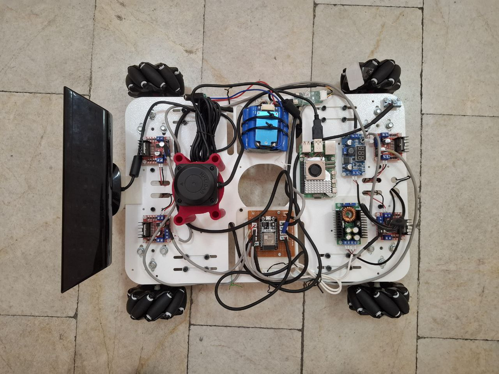
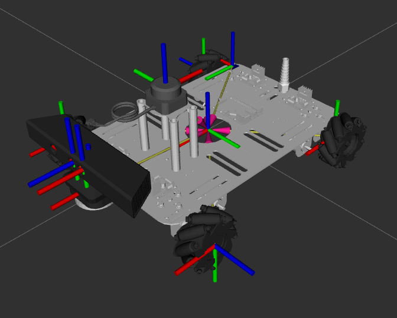
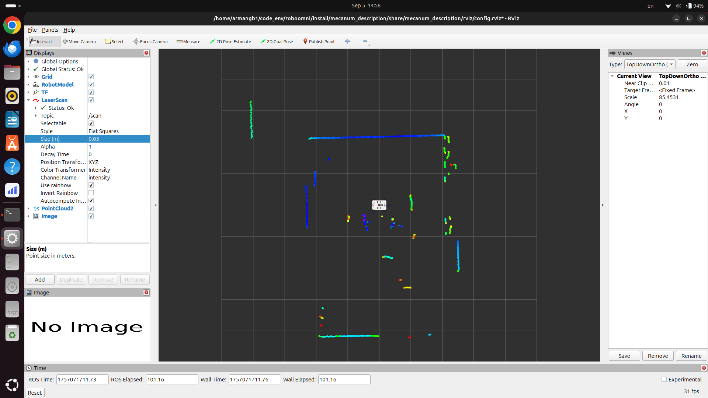
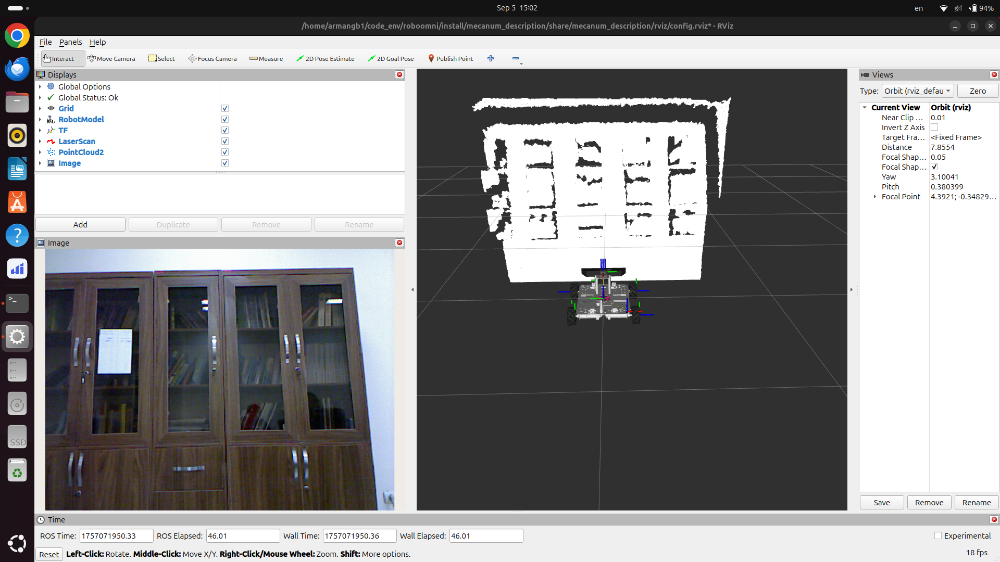
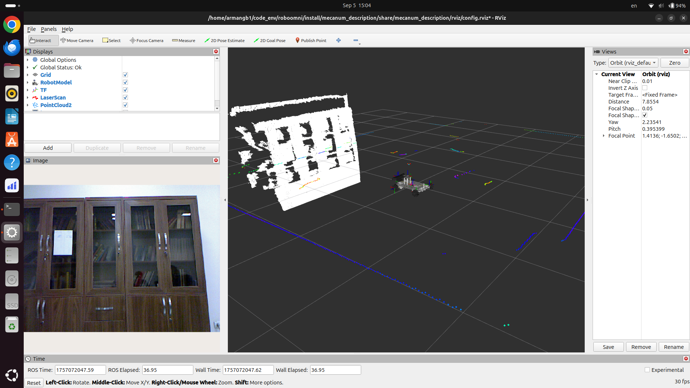
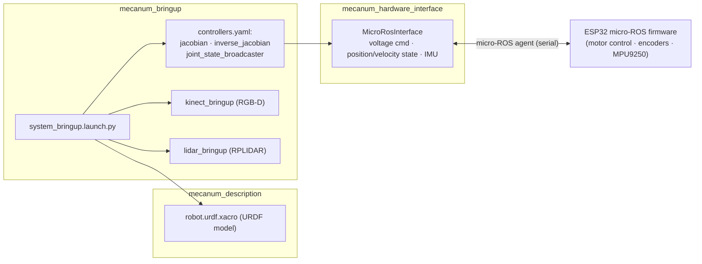

# RoboOmni

A ROS 2 (Jazzy) mobile robotics platform built on a **mecanum-wheeled** chassis and used to **collect datasets** (RGB-D, LiDAR, IMU, wheel odometry). The system is engineered end-to-end: a custom `ros2_control` hardware interface talks to an ESP32 via **micro-ROS**, custom **mecanum Jacobian controller** plugins handle the inverse kinematics, and a single launch file brings up sensors, control, and visualization.


[](https://github.com/Armangb1/roboomni/actions/workflows/build.yml)

## Demo

### Robot



### Visualization



### Sensor outputs

| LiDAR | Kinect | Kinect + LiDAR |
|---|---|---|
|  |  |  |

## Features

- **Mecanum omnidirectional drive** — 4 independently driven wheels for holonomic motion
- **Custom control stack** — `ros2_control` hardware interface + Jacobian / inverse-Jacobian controller plugins
- **Embedded integration** — ESP32 firmware bridged over **micro-ROS** (serial agent)
- **Perception sensors** — Kinect RGB-D camera, RPLIDAR, MPU9250 IMU
- **Dataset-oriented design** — synchronized wheel odometry, IMU, RGB-D, and 2D LiDAR streams for SLAM / perception research
- **Single-command bringup** — conditional launch args to enable/disable each subsystem

## Hardware

| Component | Detail |
|---|---|
| Chassis | Mecanum, 4 × 75 mm wheels |
| Motors | 4 × DC motors with encoders, driven by voltage commands |
| MCU | ESP32 running micro-ROS firmware |
| Camera | Kinect RGB-D |
| LiDAR | RPLIDAR over `/dev/ttyUSB0` |
| IMU | MPU9250 |
| Agent link | micro-ROS agent on `/dev/ttyUSB1` |

## Architecture



Wheel commands flow top-down (`cmd_vel` → Jacobian controller → per-wheel voltage → hardware interface → firmware), while odometry and IMU data flow bottom-up back to the controllers.

## Repository ecosystem

This is the main workspace repo. The rest of the robot's software is split across dedicated repositories, all pinned in [`src/.repos`](src/.repos):

| Repository | Role |
|---|---|
| [`mecanum_jacobian_controller`](https://github.com/Armangb1/mecanum_jacobian_controller) | `ros2_control` controller plugins: mecanum Jacobian + inverse-Jacobian (kinematics, TF output) |
| [`mecanum_hardware_interface`](https://github.com/Armangb1/mecanum_hardware_interface) | Custom `ros2_control` system interface: micro-ROS and UDP hardware implementations |
| [`mecanum_microros_firmware`](https://github.com/Armangb1/mecanum_microros_firmware) | ESP32 firmware: motor control, encoders, MPU9250, FreeRTOS tasks over micro-ROS |
| [`mecanum_udp_firmware`](https://github.com/Armangb1/mecanum_udp_firmware) | Alternate ESP32 firmware and UDP bridge variant |

## Workspace layout

```
src/
├── .repos                      # vcs manifest — imports external repositories
└── mecanum/
    ├── mecanum_description/    # URDF/xacro model, meshes, RViz config, visualization launches
    └── mecanum_bringup/        # system bringup launches + controllers.yaml
```

The workspace is a *partial checkout*: external repositories under `src/control/`, `src/firmware/`, and `src/third_party/` are fetched with `vcs` (see below).

## Quickstart

Requires **Ubuntu 24.04** and **ROS 2 Jazzy** (`source /opt/ros/jazzy/setup.bash`).

```bash
# 1. Fetch external repositories (controllers, hardware interface, firmware, sensor drivers)
cd src && vcs import < .repos && cd ..

# 2. Install dependencies and build
rosdep update
rosdep install -i --from-paths src/ -y
colcon build

# 3. Run the full system
source install/setup.bash
ros2 launch mecanum_bringup system_bringup.launch.py
```

> The two local packages are pure assets (launch/xacro/mesh/config) and also build standalone:
> `colcon build --packages-select mecanum_description mecanum_bringup`

### Bringup options

`system_bringup.launch.py` accepts boolean flags to enable/disable subsystems:

| Argument | Default | Purpose |
|---|---|---|
| `use_kinect` | `true` | Kinect RGB-D camera |
| `use_lidar` | `true` | RPLIDAR |
| `use_micro` | `true` | Microcontroller / micro-ROS agent |
| `use_control` | `true` | ros2_control system |
| `use_display` | `false` | RViz visualization |

### Visualization

```bash
ros2 launch mecanum_description display.launch.py
```

### Micro-ROS agent (manual)

```bash
ros2 run micro_ros_setup create_agent_ws.sh src/third_party
colcon build
```

## Sensors & frames

| Sensor | Port / topic | Frame |
|---|---|---|
| LiDAR | `/dev/ttyUSB0` | `lidar_link` |
| micro-ROS agent | `/dev/ttyUSB1` | — |
| Kinect RGB | `/kinect/rgb/...` | `kinect_rgb_optical_link` |
| Kinect depth | `/kinect/depth/...` | `kinect_depth_optical_link` |

Note: `ROS_DOMAIN_ID=1` is set in the [Dockerfile](Dockerfile). Controller and interface naming (`chassis_fr/fl/rl/rr_wheel_joint`, `voltage` command interface) must stay in sync across `robot_core.xacro`, `ros2_control.xacro`, and `config/controllers.yaml`.

## License

Apache License 2.0. See [LICENSE](LICENSE).
